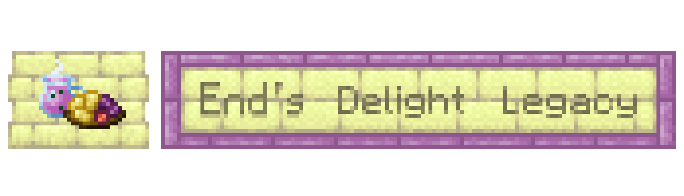

# End's Delight Legacy / 末地农家乐

## Overview

### About

**End's Delight Legacy** is an addon mod for **Farmer's Delight Legacy** on Minecraft `1.12.2`, focused on bringing End-themed culinary content to the legacy Forge environment.

This project is a `1.12.2` legacy port and adaptation of the modern **End's Delight** mod. Content, recipes, and behavior are adjusted where needed for the older game version while keeping the original mod's design intent as closely as possible.

The mod adds End-flavored ingredients, meals, drinks, knives, mob drops, placeable feasts, an End-themed stove, and related progression content built around Farmer's Delight-style cooking.

### Required Dependencies

- `Minecraft Forge 1.12.2`
- `FarmersDelightLegacy`

### Optional Compatibility

- `Future-MC`
  - Uses Future-MC content where available, such as campfires, bamboo, suspicious stew, and smithing-table behavior.
- `Netherized`
  - Can provide modern Nether fungi ingredients for recipes.
- `Unseens Nether Backport`
  - Can provide modern Nether fungi ingredients for recipes.
- `JEI`
  - Recommended for recipe lookup when playing with Farmer's Delight-style cooking.

## Features

- End-themed foods, drinks, and ingredients based on chorus fruit, chorus flowers, shulkers, endermites, endermen, dragon meat, dragon eggs, and dragon teeth.
- Farmer's Delight Legacy cooking integrations, including cooking pot recipes, cutting board recipes, campfire cooking, and stove heat support.
- End-themed knives, including special knife behavior and mob-specific drops.
- Configurable drop chances for knife-related Shulker and Enderman drops.
- Configurable food mechanics for sneak-only teleport and levitation behavior.
- Placeable foods and feast blocks, including pies, steamed dragon egg, dragon meat stew, grilled shulker, and dragon leg with sauce.
- End Stove support for Farmer's Delight Legacy cooking behavior.
- Chorus succulent world generation in the End.
- Source-style advancements for the main End's Delight progression chain.
- Compatibility fallbacks for ingredients that do not exist in vanilla Minecraft `1.12.2`.

## Credits

- Port author: `xy177`
- Original modern-version mod: **End's Delight** by `FoggyHillside`
- Required base mod: **Farmer's Delight Legacy**

## Original Mod

Original modern-version project:

- [FoggyHillside / End-s-Delight](https://github.com/FoggyHillside/End-s-Delight)

This repository is a legacy port and adaptation, not the original modern-version project.
